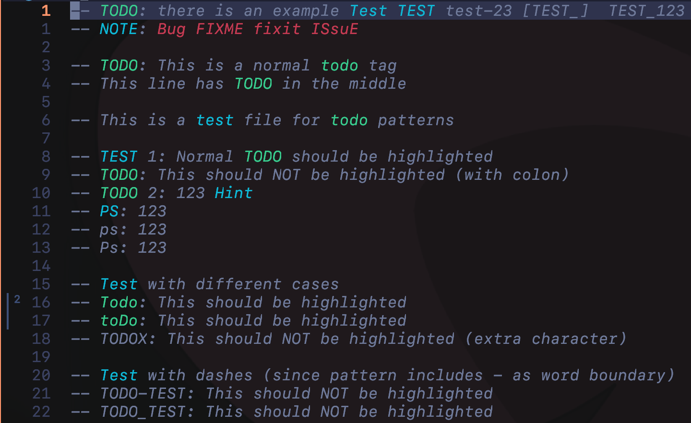
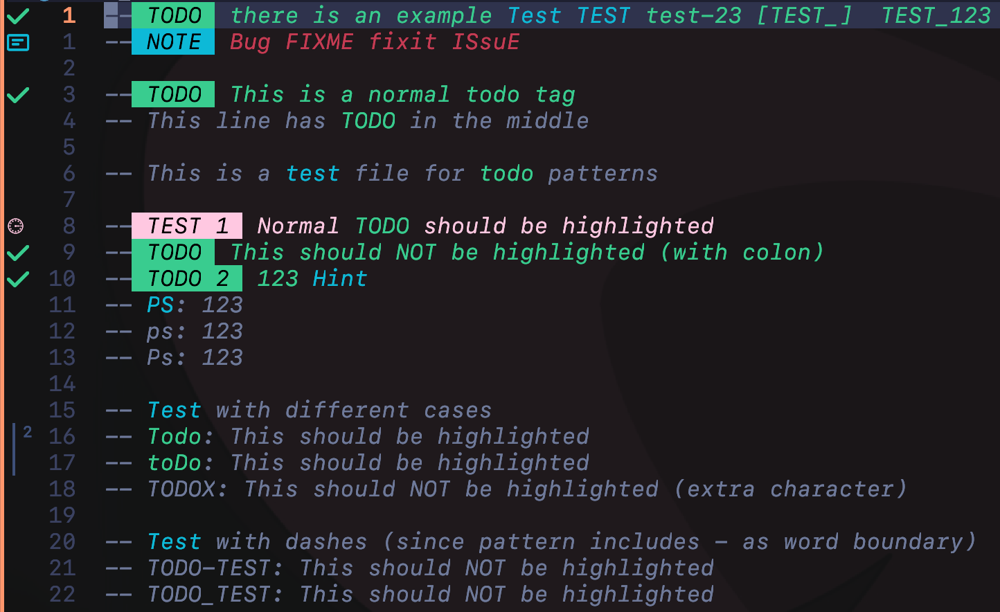

# todotag.nvim

A lightweight and customizable Neovim plugin that highlights todo tags in comments.

## Features

- **Customizable Todo Tags**: Define your own todo keywords and highlight groups
- **Smart Highlighting**: Only highlights tags in comment regions
- **Case Sensitivity**: Control whether tags are case-sensitive
- **Performance**: Efficiently highlights only visible regions with throttling
- **Exclusion Rules**: Exclude specific filetypes and buftypes
- **Priority Control**: Set highlight priority to override other plugins

## Demo

### Basic Showcase


### With todo-comments.nvim Integration


## Installation

### Using lazy.nvim

```lua
{
  "fau818/todotag.nvim",
  dependencies = { "folke/todo-comments.nvim" },  -- Optional dependency
  opts = {},
}
```

### Using packer.nvim

```lua
use {
  "fau818/todotag.nvim",
  config = function()
    require("todotag").setup()
  end
}
```

### Using vim-plug

```vimscript
Plug 'fau818/todotag.nvim'

" In your init.vim or after/plugin/todotag.vim
lua require("todotag").setup()
```

## Usage

### Start/Stop Highlighting

The plugin starts automatically when Neovim launches, but you can control it with these commands:

```vim
:TodotagStart  " Start highlighting todo tags
:TodotagStop   " Stop highlighting todo tags
```

### Default Behavior

By default, the plugin highlights the keyword `TODO` in comments with the `Todo` highlight group.

## Configuration

You can customize the plugin's behavior by passing a configuration table to `setup()`:

```lua
require("todotag").setup({
  -- Keywords recognized as todo tags
  keywords = {
    todo = { hl_group = "Todo", case_sensitive = false },
    fix = { hl_group = "Error", case_sensitive = true },
    note = { hl_group = "WarningMsg", case_sensitive = false },
  },

  -- Highlight priority (default: 501, covers todo-comments.nvim)
  priority = 501,

  -- Throttle updates (in ms, default: 250)
  throttle = 250,

  -- Only highlight in visible area (default: true)
  only_visible = true,

  -- Exclude these filetypes
  exclude_ft = { "help", "netrw", "tutor" },

  -- Exclude these buftypes
  exclude_bt = { "nofile", "prompt" },
})
```

### Custom Highlight Groups

You can define your own highlight groups using Neovim's Lua API or Vimscript:

#### Using Lua API
```lua
-- Define highlight groups with Lua API
vim.api.nvim_set_hl(0, "MyTodoTag", { fg = "#ffffff", bg = "#ff0000", bold = true })
vim.api.nvim_set_hl(0, "MyNoteTag", { fg = "#1a1a2e", bg = "#a6c1ee", italic = true })
```

#### Using Vimscript
```vim
" Define highlight groups with Vimscript
hi MyTodoTag guifg=#ffffff guibg=#ff0000
hi MyNoteTag guifg=#1a1a2e guibg=#a6c1ee
```

Then use your custom groups in the plugin configuration:
```lua
require("todotag").setup({
  keywords = {
    todo = { hl_group = "MyTodoTag", case_sensitive = false },
    note = { hl_group = "MyNoteTag", case_sensitive = false },
  },
})
```

## Key Features Explained

### Case Sensitivity

When `case_sensitive` is `false`, the plugin will match tags regardless of case:
- `TODO`, `Todo`, `todo`, and `tOdO` will all be matched

When `case_sensitive` is `true`, only the exact case will be matched.

### Smart Comment Detection

The plugin detects if a tag is inside a comment using two methods:
1. Treesitter (if available) for accurate comment detection
2. Syntax highlighting fallback for legacy support

### Performance Optimizations

- **Throttling**: Updates are throttled to prevent performance issues
- **Visible Area Only**: Only highlights lines in the visible window
- **Buffer Attach**: Attaches only to valid buffers (excludes floats, help, etc.)
- **State Management**: Tracks valid lines to avoid unnecessary re-highlighting

## Examples

### Basic Custom Configuration

```lua
-- Highlight bug tags with error group (case-insensitive)
require("todotag").setup({
  keywords = {
    bug = { hl_group = "Error", case_sensitive = false },
  },
})
```

### Comprehensive Configuration

```lua
-- Configure multiple keywords with different highlight groups
require("todotag").setup({
  keywords = {
    todo = { hl_group = "Todo", case_sensitive = false },
    note = { hl_group = "WarningMsg", case_sensitive = false },
    fixme = { hl_group = "Error", case_sensitive = true },  -- Case-sensitive
  },
  throttle = 500,  -- Reduce update frequency
  only_visible = false,  -- Highlight all lines in buffer
})
```

## Troubleshooting

### Tags Are Not Highlighted

1. Ensure the tag is inside a comment
2. Check that the filetype is not excluded
3. Verify the tag is not in a listed exclude buftype
4. Make sure the plugin is started with `:TodotagStart`

### Performance Issues

- Increase the `throttle` value to reduce the frequency of updates
- Set `only_visible` to `true` to only highlight visible lines
- Reduce the number of keywords if you have many custom tags

## Contributing

Contributions are welcome! Please feel free to submit issues and pull requests.

## License

MIT License - see LICENSE file for details

## Support

If you have any questions or issues, please open an issue on the GitHub repository: [issues](https://github.com/fau818/todotag.nvim/issues)

## Acknowledgments

- Inspired by various todo highlighting plugins
- Uses ideas from [folke/todo-comments.nvim](https://github.com/folke/todo-comments.nvim)
